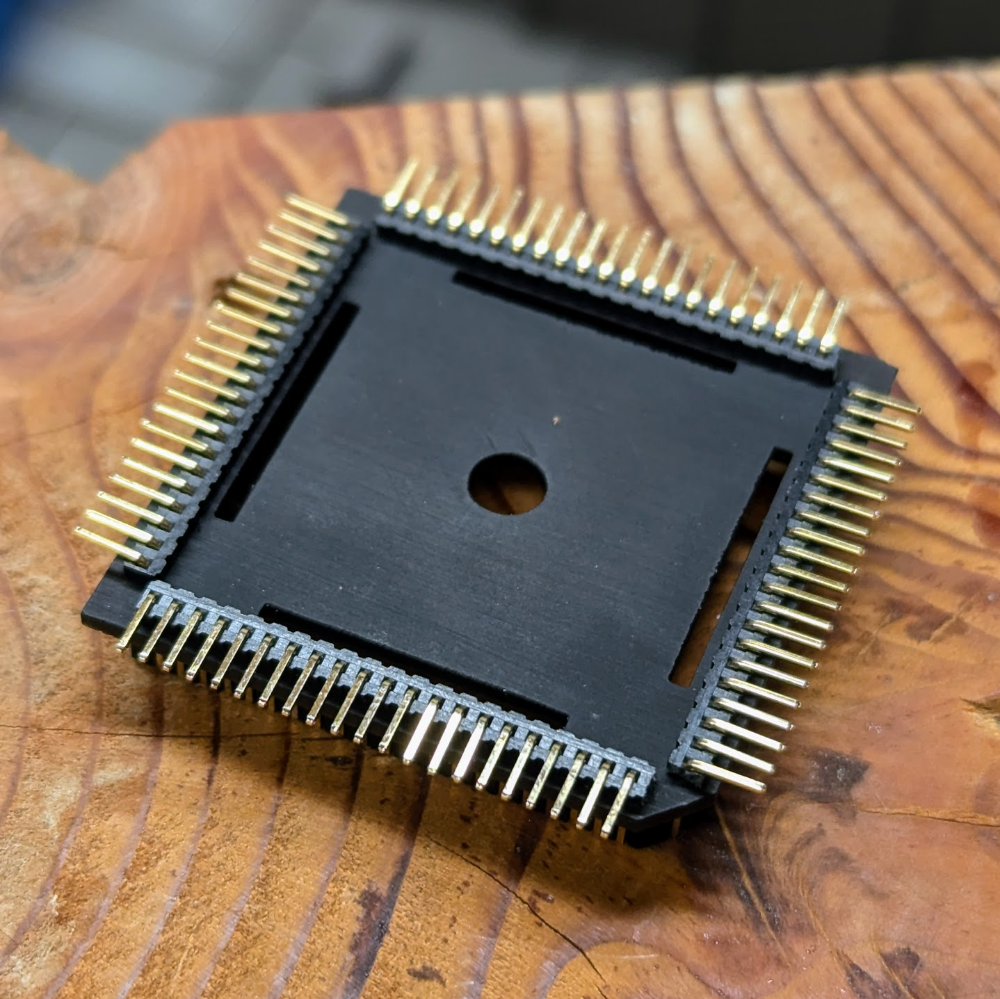
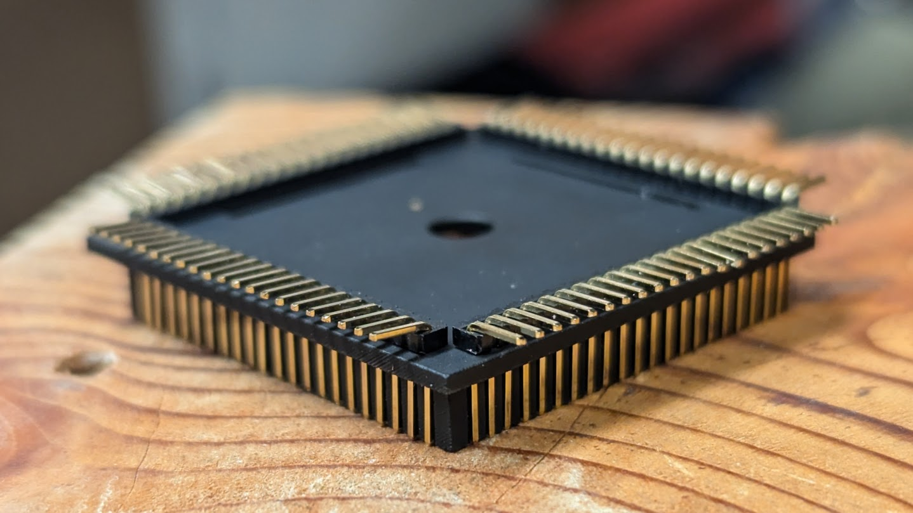
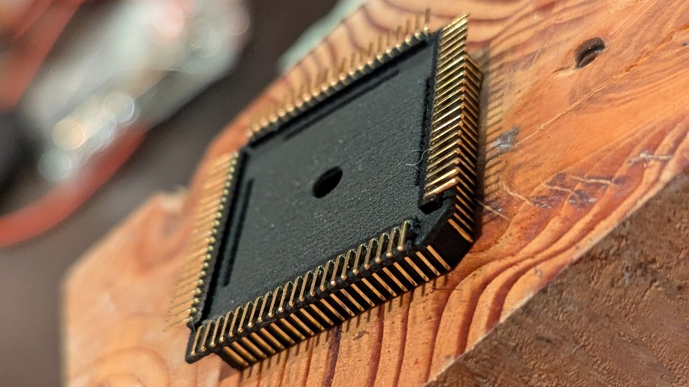
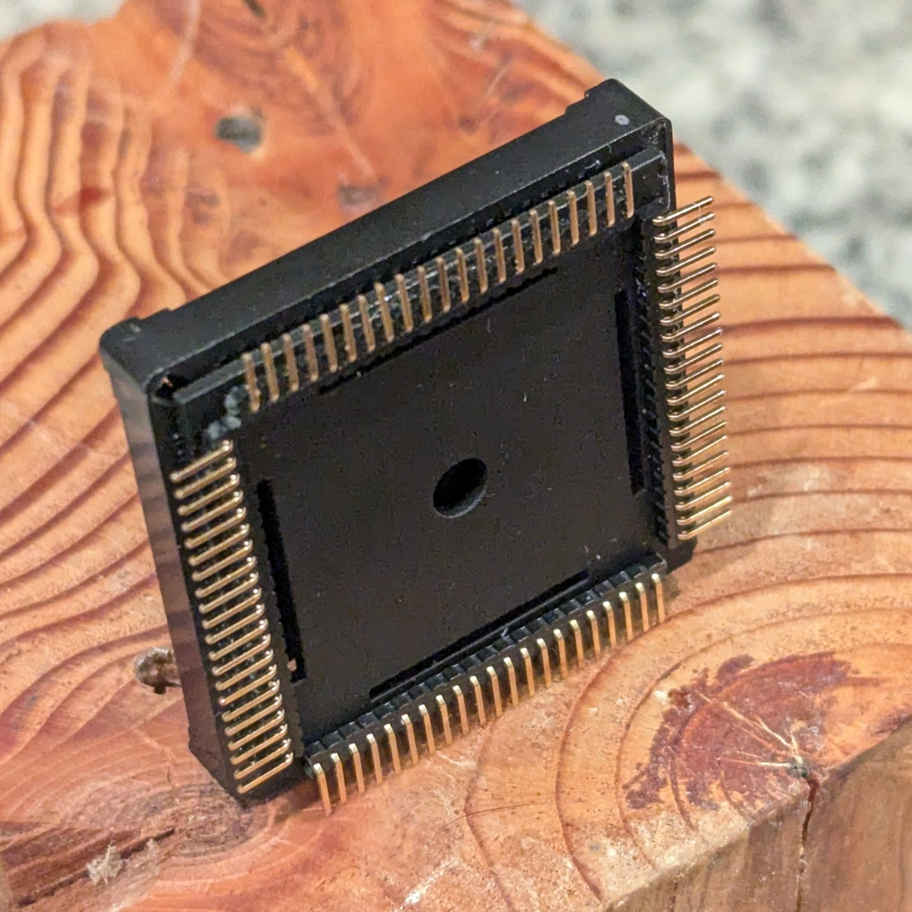
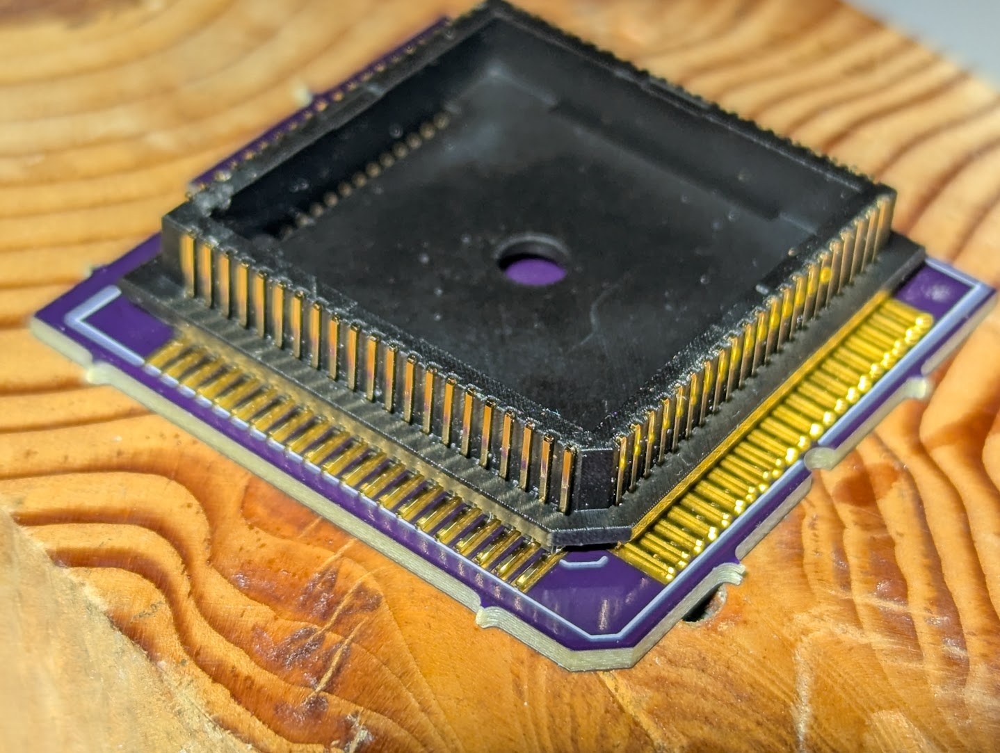

# PLCC plug

A parametric PLCC plug adapter created in OpenSCAD

***
Note: Only the 84pin PLCC plug has been tested so far. Please report
your experience, send patches, pictures etc.
***

 

 

## Prerequisites

You will need 4 pieces of 21pin 1.27mm Spacing (0.05")
Right Angle Male Pin Headers. Before pushing the into the plug's plastic
housing, be sure to push the pin header's plastic insulator all the way
to the bend all the way to the bend. I used uxcell pin headers with the
product number *a14081900ux0298*.

Other suitable pin headers to use with this plug: 
1.27 mm 50 P 1 x 50 Pin Header Single row Right Angle Male 
https://www.aliexpress.com/item/32767692043.html
 

## Printing

The PLCC plug is probably too fine pitched to print with an FDM printer.
I certainly did not succeed printing on a Prusa MK3s with 0.4mm nozzle.
A 0.2mm nozzle might yield more success. However, I suggest to print
these with nylon at a service like JLCPCB. Nylon is very heat resistent
and gives overall good results with dimensional stability and accuracy.
I also did some test prints in black resin at JLCPCB.

 

Black resin print
 
 

Nylon print
 

## Fitting

 

Socket fitting
 

Socket fitting
 

***

[![CC BY-SA 4.0][cc-by-sa-shield]][cc-by-sa]

This work is licensed under a
[Creative Commons Attribution-ShareAlike 4.0 International License][cc-by-sa].

[![CC BY-SA 4.0][cc-by-sa-image]][cc-by-sa]

[cc-by-sa]: http://creativecommons.org/licenses/by-sa/4.0/
[cc-by-sa-image]: https://licensebuttons.net/l/by-sa/4.0/88x31.png
[cc-by-sa-shield]: https://img.shields.io/badge/License-CC%20BY--SA%204.0-lightgrey.svg
